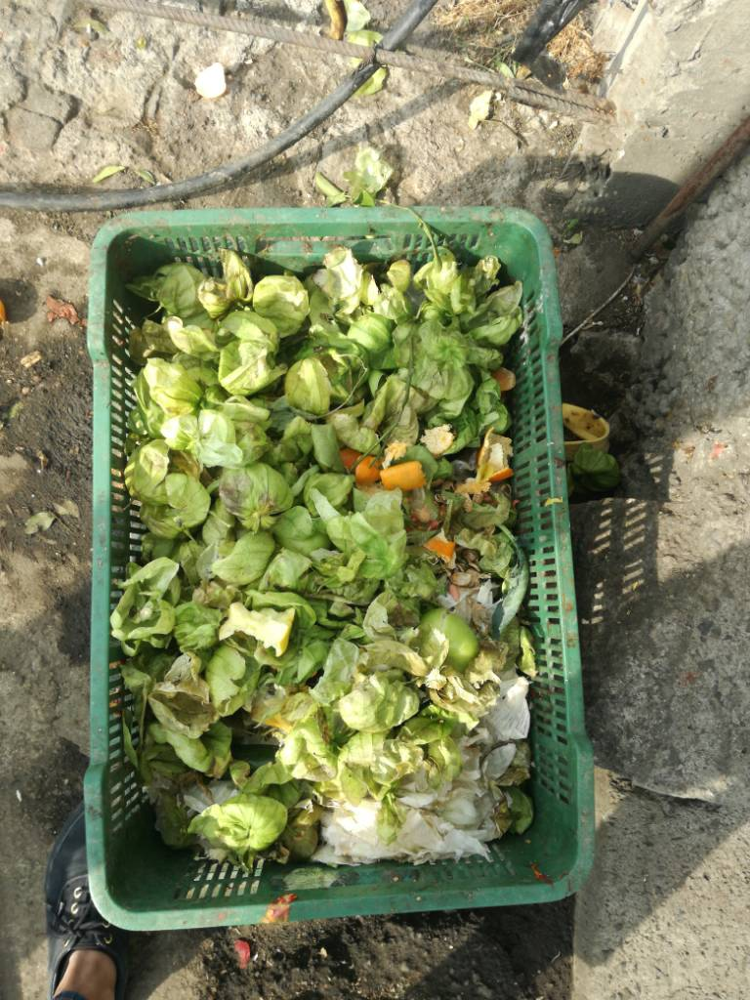
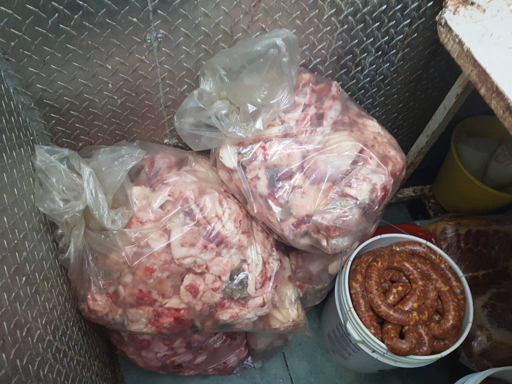
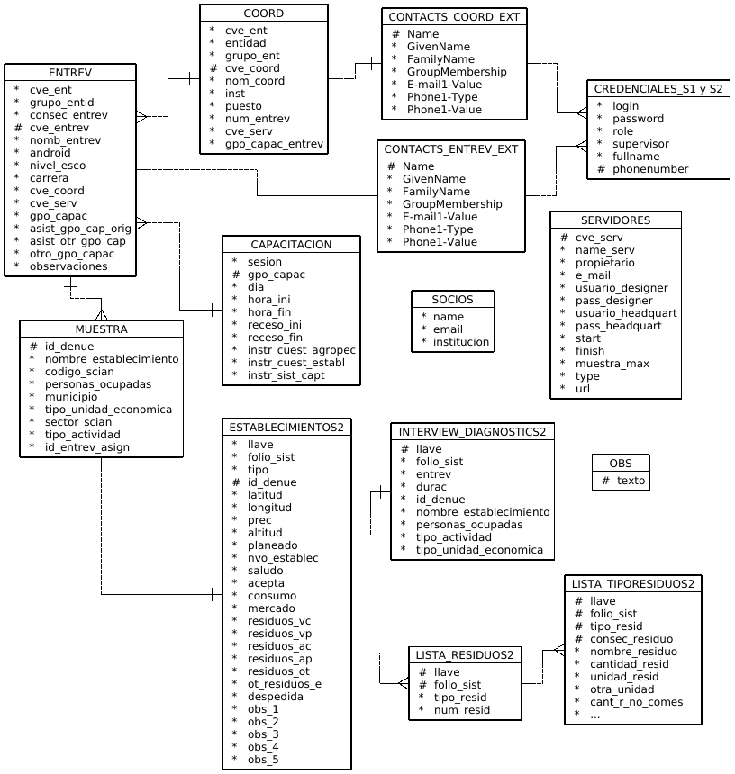

---
title: "**Validación y Procesamiento**"
--- 

<div class=text-justify>


El objetivo de este apartado es describir el registro puntual de cada de una de las acciones realizadas para la preparación, validación e integración de la Base de Datos, desde la salida de captura, hasta la versión final, para su explotación y análisis.

<br>

## Descripción del Sistema de Captura

<br>

Los sistemas electrónicos de captura, denominados sistemas CAPI (Computer Assisted Personal Interview), son herramientas de gran utilidad para el aseguramiento de la calidad de los datos. Se trata de la modalidad en la que se sustituye el formato de cuestionario en papel por su aplicación en dispositivos móviles como tabletas o teléfonos celulares, en cuya pantalla van apareciendo las preguntas del cuestionario. Una vez que el informante proporciona la respuesta, el entrevistador la registra en el dispositivo y se guarda automáticamente en la memoria de éste.

Concluida la entrevista, puede realizarse el envío de la información captada a la sede local o central donde se realiza el procesamiento, a través de Internet u otros protocolos de comunicación o se puede conectar el dispositivo directamente a una computadora o servidor donde se esté integrando la base de datos de la encuesta.

El uso de estos sistemas de captura presenta varias ventajas entre, ellas: 

- Los sistemas pueden programarse incluyendo diferentes validaciones, de tal modo que
aseguren una mayor limpieza de la información desde el momento mismo de la entrevista.

- Dichas validaciones incluyen verificaciones de secuencia, tales como pases, filtros y la posibilidad de direccionar la secuencia hacia secciones específicas del cuestionario a través de preguntas pivote o disparadoras; otro tipo de validaciones comunes comprenden la revisión de omisión en las respuestas o de rangos válidos de las mismas. 

- Esto facilita el trabajo del entrevistador cuando la secuencia o los filtros en los cuestionarios son complejos o cuando la aplicación de ciertas preguntas depende de las respuestas que el informante ha dado con anterioridad. 

- Con ello, se disminuyen los riesgos asociados a un manejo incorrecto del instrumento de captación, ya que el sistema verifica las respuestas registradas y asegura que el cuestionario fluya de manera natural.

- La administración del operativo de campo puede realizarse desde los módulos de control de cargas de trabajo y asignación de roles que los sistemas CAPI contienen como parte de su programación. 

- Las aplicaciones más recientes de este tipo poseen la programación necesaria para dar seguimiento georreferenciado de cada una de las unidades de observación, de modo que para los supervisores o administradores del operativo resulta muy fácil la verificación de la ubicación de las unidades de la muestra, el control operativo en términos de avances de cobertura en las unidades levantadas y la posibilidad de generar mapas interactivos para ir dando cuenta de la distribución geográfica de las entrevistas.

- Además de las validaciones básicas, pueden programarse otras relacionadas con aspectos conceptuales entre variables, de tal manera que al concluir la entrevista el sistema verifique la consistencia o correspondencia que debe haber entre preguntas o grupos de preguntas. Si el sistema detecta alguna irregularidad, es capaz de emitir una alerta para que el entrevistador haga alguna verificación con el informante antes de abandonar la vivienda.

- Este tipo de herramientas electrónicas no requiere conocimientos de programación
elaborada, pues tiene interfaces muy amigables. El usuario tampoco requiere la habilitación de plataformas de alojamiento en servidores para las bases de datos, ya que la mayoría de estas aplicaciones cuentan con la posibilidad de albergar los datos en servidores de Internet (nube). 

- Esto hace muy asequible su uso, pues el usuario no requiere contar con una infraestructura de hardware especial para la encuesta. **En particular, para el levantamiento de esta prueba piloto, se usó una plataforma desarrollada por el Banco Mundial denominada [___Survey Solutions___](https://mysurvey.solutions/){target="_blank_"}**, la cual es gratuita, cumple con todas las características ya descritas, y tiene como objetivo brindar a los países con limitaciones en infraestructura informática una aplicación que permita realizar encuestas sociales o gubernamentales de forma sencilla y económica.

<br>

El funcionamiento a grandes rasgos de la aplicación es el siguiente:

1. Se crea una cuenta en la plataforma *Survey Solutions* (SS). Para hacerlo sólo se requiere una cuenta de correo electrónico y llenar un formato de registro con una breve descripción de la encuesta.

3. Se solicita un servidor personal para alojar la encuesta. La aplicación reserva un espacio para el mismo y concede el control de la interfaz operativa para la encuesta, en la cual se pueden cargar supervisores y entrevistadores, asignar cargas de trabajo y dar seguimiento al avance del operativo, a través de diversas herramientas, en [_Survey Solutions Headquarters_](https://support.mysurvey.solutions/headquarters/){target="_blank_"}. Este servidor tiene un periodo de servicio de un mes, y un límite máximo de alojamiento de 1000 entrevistas, lo cual resulta más que suficiente para los propósitos de la prueba piloto. En el caso nuestro solicitamos dos servidores independientes, para preveer cualquier número de entrevistas posibles provenientes de la prueba sin que se saturara su capacidad, incluidas las pruebas necesarias.


2. Una vez creada la cuenta y servidor, se puede acceder a la [página del diseñador de cuestionarios](https://designer.mysurvey.solutions/Identity/Account/Login?ReturnUrl=%2F){target="_blank_"}, en la cual se realiza la programación del cuestionario mismo. Esta interfaz de programación está basada en bloques (preguntas tipo), por lo que es muy intuitiva y sencilla, y no requiere de conocimientos previos, ni de lenguajes de programación.

3. Ya diseñado el cuestionario, éste se importa desde el administrador del servidor y se carga en el servidor de la encuesta.

4. Cada entrevistador descarga e instala la aplicación en su teléfono o tableta (Android), desde el sitio de descarga: https://demo.mysurvey.solutions/Download .

5. Cuando se abre la aplicación por primera vez en el dispositivo, debe escanearse un código QR que se genera desde el administrador para cada entrevistador. Con este acceso, se permite la sincronización por Internet entre el dispositivo y el servidor, y se puede  proceder a la descarga de los cuestionarios en el dispositivo y su eventual ejecución.

6. Una vez realizadas las entrevistas, con la periodicidad definida por el control operativo de la encuesta, los dispositivos se sincronizan con el servidor a través de Internet, para enviar las entrevistas captadas y recibir nuevas cargas de trabajo.

7. Finalmente, los datos captados, se van alojando en el servidor, donde en la sede central pueden liberarse y al final del operativo descargarse como una carpeta de tablas en formatos *tab*, *sav* o *sas*.

<br>

A continuación se muestra un video de llenado del cuestionario electrónico para establecimientos a modo ilustrativo.

</div>

<br>

<div class=text-center>

<video width="250" height="500" controls muted>
    <source src="archivos/llenado.mp4?rel=0" type="video/mp4">
</video>

</div>


<br>
<br>
<br>

<div class=text-justify>
 

<br>
<br>

## **Procesamiento**

<br>


### **Preparación y Validación de la Base de Datos** 

<br>

Como se mencionó en el  apartado anterior, se ha dispuesto de un conjunto de tablas descargadas de la plataforma *Survey Solutions*, que se descargan en una carpeta denominada *bd_captura*. A esta versión de la base de datos de captura, que aún se encuentra sin depurar, se le aplicarán los tratamientos de validación y procesamiento que se describen enseguida y que dan origen a una nueva versión de la base de datos lista para su explotación.

Este proceso comprende todos los pasos necesarios que deben seguirse para tratar los datos captados en campo (Base de datos de salida), a fin de depurar y eliminar cualquier inconsistencia en los mismos, de tal modo que pueda generarse una versión de la base de datos que pueda ser explotada con confianza. Se está preparando una bitácora de procesamiento que se incluirá en este mismo documento para que cualquier usuario pueda conocer los procedimentos.

<br>

### **Validación en línea del cuestionario**
<br>

Una de las grandes ventajas que proporcionó el uso de la plataforma del cuestionario electrónico, fue la posibilidad de insertar dentro del instrumento de captación, validaciones básicas que aseguran la calidad de los datos desde la salida misma de captura. Específicamente, comprenden al menos 3 tipos de validaciones:

1) De secuencia lógica del cuestionario. Corresponden a las validaciones referentes al flujo de las preguntas, y comprenden los filtros y pases entre preguntas y secciones. La aplicación garantiza que al programarse dichos elementos, no pueda cerrarse la entrevista si existen errores de este tipo, por lo que el entrevistador puede corregir de inmediato cualquier situación indeseable al respecto.

2) Rangos válidos. El cuestionario electrónico garantiza que una variable no podrá contener un rango distinto de valores para lo que se programa. Esto excluye también la posibilidad de captar caracteres o tipos de datos ajenos a lo que se espera.


<br>
<br>

### **Bitácora de procesamiento**

El conjunto de procedimientos aplicados a la BD de salida para llegar hasta la construcción de la BD para explotación, puede encontrarse en el documento que se muestra a continuación, denominado *Bitácora de Procesamiento*.

<br>

<iframe src="procesamiento/Bitacora_de_Procesamiento.pdf" style="width:100%; height:650px;" frameborder="0"></iframe>

<br>
<br>

Como resultado de todo este proceso, se obtienen siguientes bases de datos:

- [Base de datos del cuestionario de unidades agropecuarias](base_de_datos/agropecuario/bd_agropecuario_pp_eramo2020.zip){target="_blank"}

- [Base de datos del cuestionario de unidades económicas relacionadas con el sector alimentario](base_de_datos/establecimientos/bd_establecimientos_pp_eramo2020.zip){target="_blank"}

<br>
<br>

### **Captura de fotografías** 

<br>

Debido a que la plataforma y herramientas informáticas definidas, permiten tomar fotografías como evidencia del trabajo, se puso a prueba la capacidad tanto de los dispositivos móviles para la captura, almacenamiento y transferencia de archivos, como del repositorio en la nube para su resguardo. El resultado fue positivo pues una gran cantidad de fotos ahora es parte de nuestro acervo fotográfico.

<br>

Algunas fotografías tomadas son las siguientes:

<br>

```{r fig.align='center', out.width= '60%', echo=FALSE, cache=TRUE}


```

<br>

```{r fig.align='center', out.width= '60%', echo=FALSE, cache=TRUE}



```

<br>

```{r fig.align='center', out.width= '60%', echo=FALSE, cache=TRUE}



```

<br>
<br>

### **Base de datos operativa** 
<br>

Las tablas creadas para propósitos de control operativo de la prueba piloto. Contienen los listados de las figuras operativas de la encuesta (entrevistadores, coordinadores), datos de contacto, horarios y grupos de capacitación, credenciales de acceso a los servidores y en general la información necesaria para conocer los pormenores de estas figuras. La tabla que contiene la muestra se incluye en este conjunto. Se trata de una muestra dirigida (no probabilística), por lo que no se cuenta con un diseño estadístico de la misma. Los resultados de este ejercicio nos brindarán algunos elementos para generar precisamente dicho diseño. **La tabla muestra, como podrá verse en el diagrama entidad-relación más adelante, funciona como el enlace entre ambos conjuntos de tablas.** Estas tablas, dado que se fueron armando conforme se crearon los grupos de trabajo, no requieren validación ni procesamiento previo.


<br>

Como resultado de los procedimientos anteriores, se conformó la base de datos denominada [**pp_eramo2020_operativa.db**](base_de_datos/pp_eramo2020_operativa.db).

Cuyo diagrama entidad-relación es el siguiente:

<br>

```{r diag_er, fig.align='center', out.width= '100%', echo=FALSE, cache=TRUE, fig.cap="**Diagrama Entidad-Relación de la Base de Datos**"}



```

<br>

***(Está pendiente completar la elaboración del diagrama entidad-relación de la base de datos para explotación de la encuesta.)***

<div/>